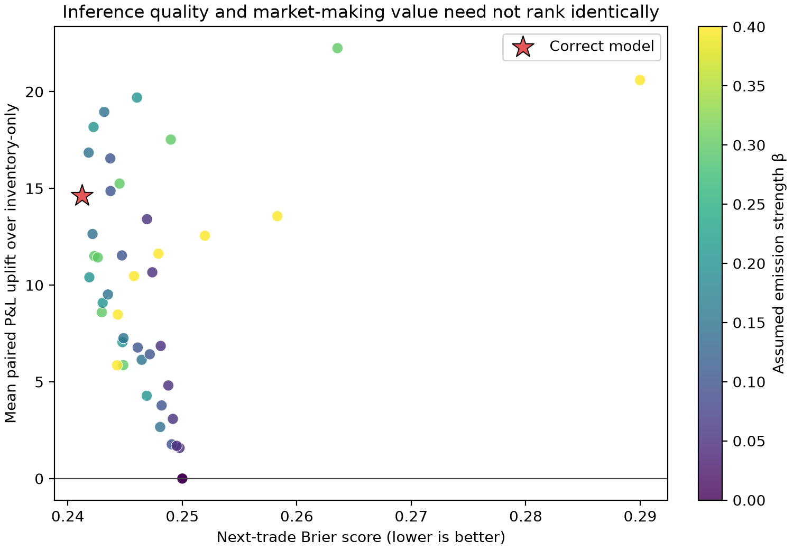
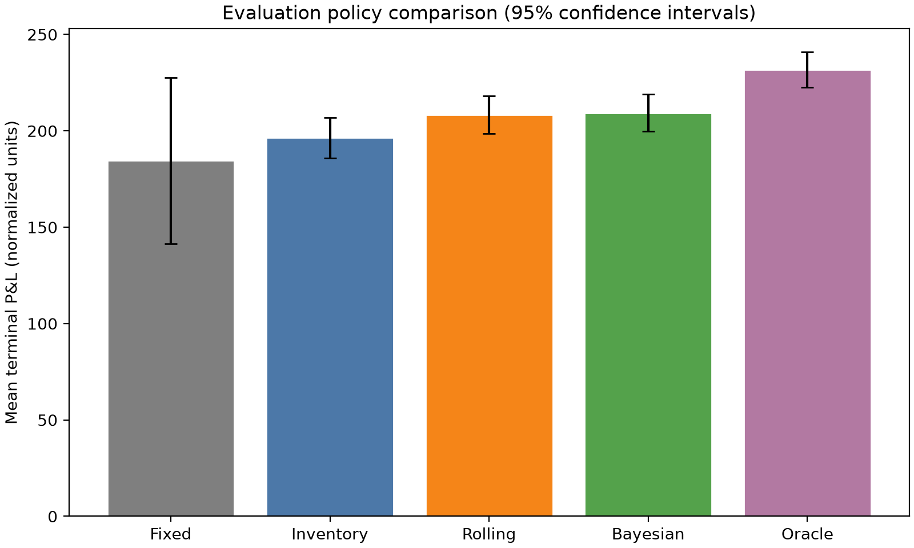
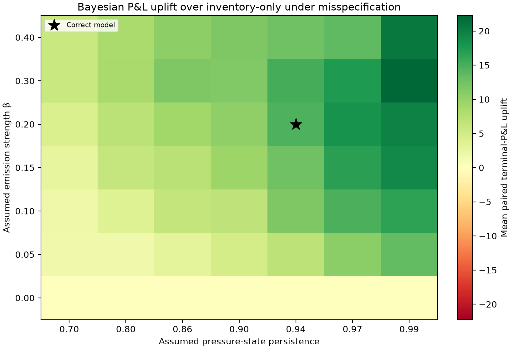
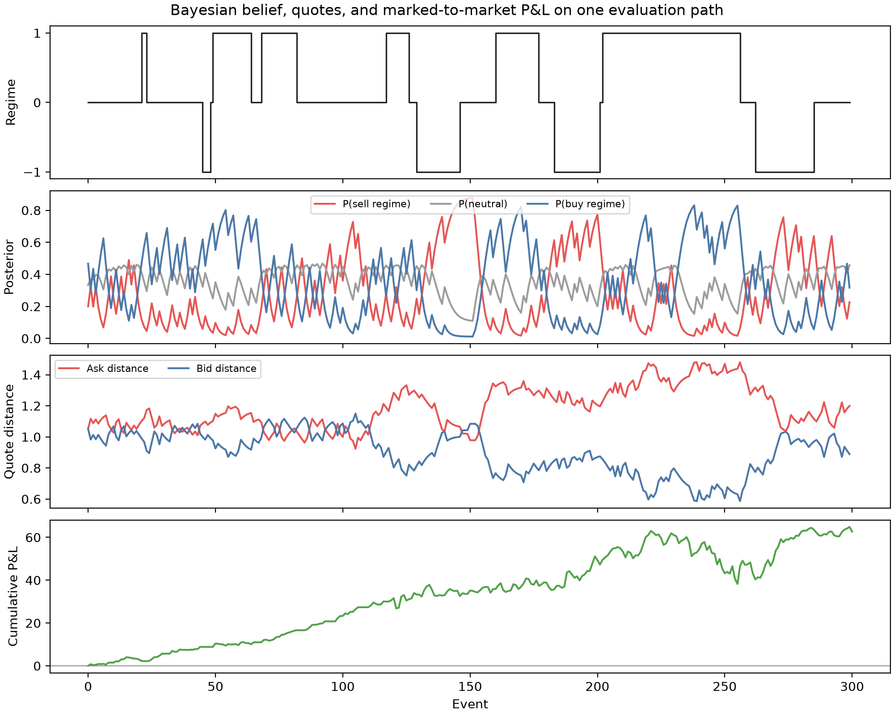

# When Does Better Inference Make a Better Market Maker?

This project tests whether better inference about persistent order flow leads to better market-making decisions in a synthetic simulation. I hold a simple quoting rule fixed and compare how different beliefs about a latent order-flow regime affect forecasts, quotes, fills, inventory, and terminal P&L.

## Main result

Across 300 evaluation paths of 1,000 events, the HMM-informed policy earned a mean terminal P&L of **209.28** normalized units versus **196.44** for the inventory-only baseline, an average uplift of **12.83** with a 95% confidence interval of **[10.80, 14.86]**.

The more interesting result is that better forecasting didn't always lead to better trading decisions. Across 49 misspecified HMMs, Brier score and P&L uplift had a Spearman correlation of **−0.427** (lower Brier is better). The highest-P&L model in that grid was more persistent than the correct one and had a *worse* Brier score.



## Model

The simulator runs in event time with a three-state latent order-flow regime:

```text
Z_t ∈ {-1, 0, +1}

P(Y_t = +1 | Z_t = z) = 1/2 + βz

S_{t+1} = S_t + μZ_t + σε_{t+1},   ε ~ N(0,1)
```

Here, `Z_t` is the latent regime, `Y_t` is the public trade sign, and `S_t` is the midprice. `MarketParams` defines the synthetic market dynamics and shared execution settings. `FilterParams` defines the transition matrix, emission strength, and economic map used by the Bayesian policy.

Each seed generates one immutable `MarketPath` containing latent states, public trade signs, Gaussian shocks, prices, and execution uniforms. Every policy is evaluated on the same path, which makes the comparisons directly pathwise.

### Bayesian filter

Given the previous posterior, the one-step predictive belief is

```text
bar_π_t(j) = Σ_i π_{t-1}(i) P_ij.
```

Before quoting, the policy computes side-conditional posteriors for the two possible next trade signs:

```text
π_t^(y)(j) ∝ P(Y_t = y | Z_t = j) bar_π_t(j),   y ∈ {-1, +1}.
```

These beliefs produce adverse-selection adjustments

```text
c_a = μ_hat E[Z_t | next trade is BUY]

c_b = -μ_hat E[Z_t | next trade is SELL].
```

After the public sign arrives, the posterior is updated with the same Bayes rule. The filter is implemented directly in NumPy and uses the HMM parameters supplied by the synthetic model.

### Quoting rule

Execution at quote distance `δ` has probability

```text
p_fill(δ) = p0 exp(-kδ).
```

With quadratic inventory penalty `R(q) = ηq²`, the side objectives are

```text
J_a(δ) = p0 exp(-kδ) [δ - c_a + η(2q - 1)]

J_b(δ) = p0 exp(-kδ) [δ - c_b - η(2q + 1)].
```

This gives the interior quote distances

```text
δ_a* = 1/k + c_a - η(2q - 1)

δ_b* = 1/k + c_b + η(2q + 1).
```

The implementation uses `max(0, δ*)` as a minimum-distance safeguard. The result is a belief-dependent, **myopic** quoting policy.

## Policies

- **Fixed:** uses a constant symmetric distance `1/k` and ignores inference and inventory.
- **Inventory:** uses the same quoting rule with adverse-selection costs set to zero.
- **Rolling:** fits a conditional OLS model of price changes using trailing sign imbalance, trade side, and their interaction on separate training paths. At quote time, it evaluates hypothetical buy and sell signs using only the observed history. `W ∈ {5, 10, 20, 50, 100}` is selected by validation MSE.
- **Bayesian:** uses HMM side-conditional posteriors and the assumed `μ` map.
- **Oracle:** uses the latent state `Z_t` directly as a full-information benchmark.

Cash and inventory update at the quoted execution price. Wealth is `X_t + q_t S_t`, with a common terminal liquidation charge of `0.10 × |q_T|`. Reported markout is the maker-side one-event loss `Y_t(S_{t+1} - S_t)` averaged over fills.

## Reproduce

Python 3.11 or newer is required. From a clean checkout:

```bash
python -m venv .venv
.venv/bin/pip install -e ".[dev]"
.venv/bin/pytest
.venv/bin/ruff check .

.venv/bin/python experiments/benchmark.py --paths 300 --sweep-paths 80 --horizon 1000
.venv/bin/python experiments/misspecification.py --paths 80 --horizon 1000
.venv/bin/python experiments/inference_vs_decision.py
```

The rolling baseline uses seeds 1000–1029 to fit each candidate window and 1030–1039 for validation, then refits the selected window (10) on all 40 training paths. The benchmark, sensitivity, and misspecification runs use disjoint deterministic seed ranges. Running the scripts overwrites the derived CSV/JSON files in `data/` and the PNG figures in `figures/`.

## Benchmark

All P&L figures are in normalized simulation units. Confidence intervals for mean P&L are cross-path intervals, and uplift intervals use paired differences on common paths.

| Policy | Mean P&L [95% CI] | Std. dev. | 5% CVaR | Mean max drawdown | Fill rate | RMS inventory | Max \|inventory\| | Adverse markout |
|---|---:|---:|---:|---:|---:|---:|---:|---:|
| Fixed | 184.54 [141.52, 227.55] | 380.16 | -935.56 | 293.37 | 0.333 | 15.66 | 30.11 | 0.0317 |
| Inventory | 196.44 [185.95, 206.94] | 92.74 | -38.22 | 64.66 | 0.326 | 4.54 | 11.73 | 0.0278 |
| Rolling | 208.36 [198.62, 218.09] | 86.04 | -6.10 | 56.98 | 0.316 | 4.23 | 10.98 | 0.0257 |
| Bayesian | 209.28 [199.62, 218.93] | 85.32 | -5.19 | 56.05 | 0.317 | 4.18 | 10.88 | 0.0254 |
| Oracle | 231.77 [222.61, 240.92] | 80.91 | 34.59 | 50.38 | 0.318 | 4.03 | 10.57 | 0.0202 |

The two inference-based policies were close on these simulations. The HMM earned 0.92 more units than the rolling baseline on average, with a 95% paired interval of [−0.22, 2.06]. For next-trade prediction, the Bayesian filter achieved a Brier score of **0.2416**, log loss **0.6761**, and latent-state MAP accuracy **0.5784**. Fixed quoting had much larger dispersion and tail losses because it didn't control inventory.



## Misspecification and sensitivity

A few patterns stood out:

- When `β=0`, trade signs carry no information about the latent regime, and the Bayesian uplift drops to exactly zero.
- When `μ=0`, the latent regime has no effect on price, and the Bayesian uplift again drops to zero.
- Some misspecified HMMs achieved higher terminal P&L than the correctly specified model even though their forecasts were worse.
- MAP state accuracy could look high while the inferred signal had little decision value, especially when the neutral regime dominated.

Forecast quality and trading quality measure different things. Some misspecified models quoted more conservatively, which reduced fills and inventory exposure. Since the quoting rule is myopic and the final evaluation uses terminal wealth, that could improve P&L even when forecast calibration got worse.





Raw results are in [`data/benchmark.csv`](data/benchmark.csv), [`data/sensitivity_sweeps.csv`](data/sensitivity_sweeps.csv), [`data/misspecification_grid.csv`](data/misspecification_grid.csv), and [`data/economic_map_misspecification.csv`](data/economic_map_misspecification.csv).

## Limitations

- The parameters and units are synthetic and normalized, so the results describe behavior inside this simulator.
- The simulator omits queue position, matching-engine mechanics, latency, cancellations, variable order sizes, tick size, fees and rebates, book depth, and maker price impact.
- Public trade signs are exogenous, and the maker is price-taking.
- The quoting policy is myopic, so it doesn't account for continuation value.
- The filter uses the simulator's supplied HMM parameters; it doesn't estimate them from observations.
- The reported confidence intervals quantify Monte Carlo uncertainty within the simulation.
